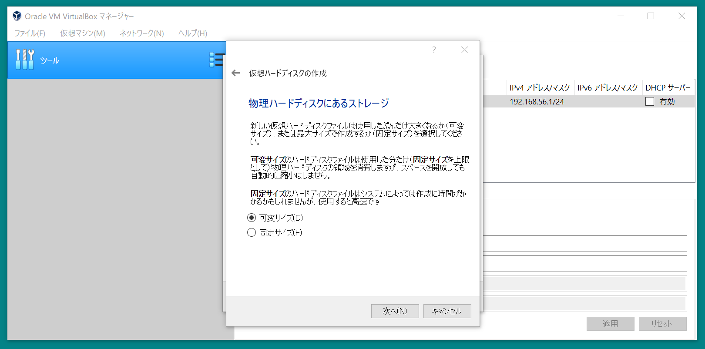
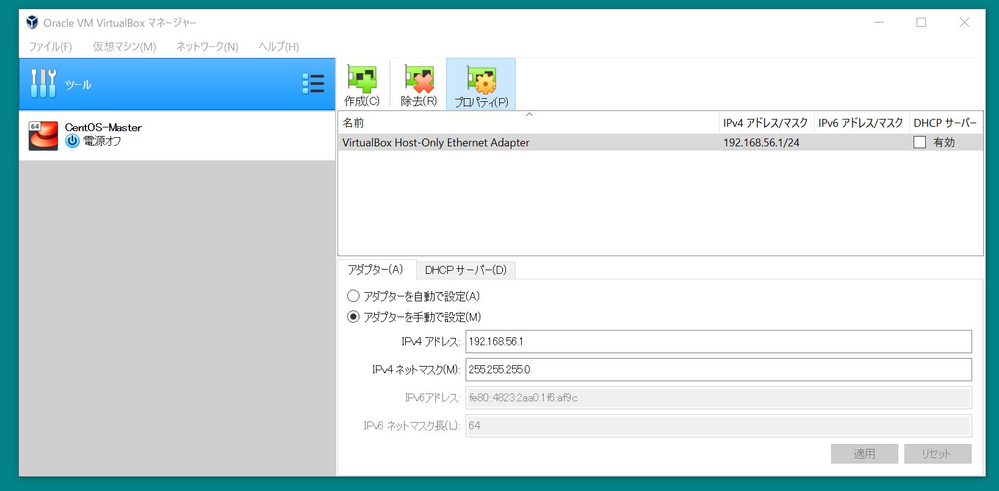
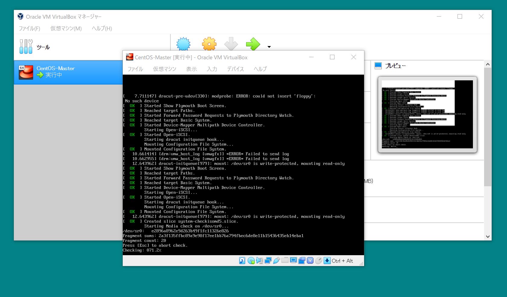
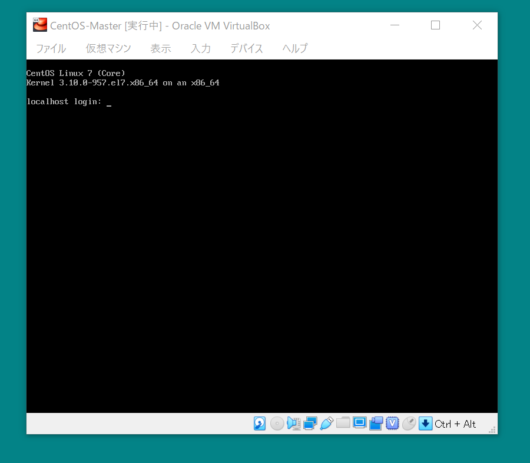
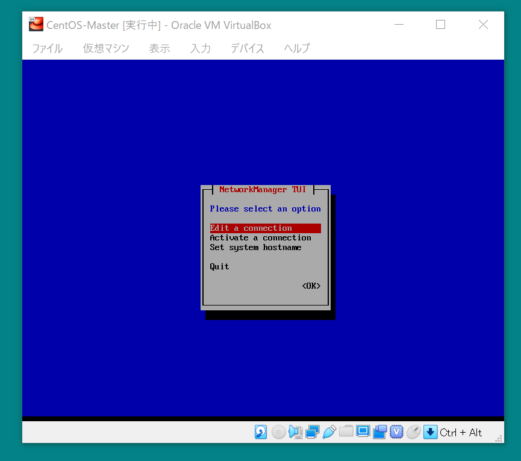

<!-- TOC -->

- [はじめに](#はじめに)
- [インストール手順](#インストール手順)
    - [VirtualBox](#virtualbox)
    - [CentOS7のインストール](#centos7のインストール)
    - [ネットワーク設定とSSH接続確認](#ネットワーク設定とssh接続確認)

<!-- /TOC -->

# 1. はじめに
この手順ではVirtualBoxのインストールからCentOs7のインストールとネットワークのセットアップまでを紹介します。

# 2. インストール手順

## 2.1. VirtualBox
VirtualBoxをインストールします。

1. VirtualBoxのインストーラーを起動する。 
1. Custom Setupが表示されるので必要であれば編集する。（デフォルトを使用） 
1. インストール後の各種設定に聞かれるので必要なものにチェックする。（デフォルトを使用） 
1. ネットワークインターフェースをインストールする警告が表示されるので"Yes"を選択する。 
1. インストール直前の確認が促され問題なければInstallを押下する。 
1. インストールが開始される。（インストール中） 
1. インストールが完了したらFinishを押下する。 

## 2.2. CentOS7のインストール
作成した仮想マシンにCentOS7をインストールする。

1. VirtualBoxを開く。 
1. 仮想マシン > 新規を押下する。 
1. "仮想マシンの作成"の項目を編集する。 
1. メモリを編集する。 
1. ハードディスクを選択する。（今回は仮想ハードディスクを作成） 
1. ハードディスクのファイルタイプを選択する。（今回はVDIを使用） 
1. 物理ハードディスクにあるストレージを選択する。（今回は可変サイズ） 
1. ファイルの場所とサイズを編集して作成する。（場所はデフォルトでサイズは16GB） 
1. 仮想マシン（側のみ）が作成されたことを確認する。 
1. 作成した仮想マシンの設定を開く。 
1. ストレージを選択する。 
1. 属性の光学ドライブにあるディスクマークを選択する。 
1. インストールするCentOS7のイメージを選択する。 
1. イメージが選択された事を確認する。 
1. 仮想マシンの起動を押下する。 
1. 仮想マシンが起動される。 
1. ロード画面が表示される。 
1. インストーラー画面が表示され言語を選択する。 
1. インストール先を選択する。 
1. 先ほど作成したディスクを選択する。 
1. "インストールの開始"を押下する。 
1. ユーザーの設定に切り換わる。 
1. rootのパスワードの編集画面が表示される。 
1. rootのパスワードを編集して完了を押下する。 
1. しばらくすると再起動を促されるので再起動ボタンが表示されたら押下する。 
1. 仮想マシン上でlogin画面が表示される。 

## 2.3. ネットワーク設定とSSH接続確認
下記の手順はNATとホストオンリーアダプターの設定について紹介する。

1. ツール > 作成を押下してホストオンリーネットワークを作成する。 
1. ホストオンリーネットワークが作成されたことを確認する。 
1. 仮想マシンの設定を押下する。 
1. 設定一覧のネットワークを選択する。 
1. タブのアダプター2を開きホストオンリーアダプターを選択する。 
1. 名前を前述で作成したホストオンリーネットワークを選択する。（MACアドレスを覚えておくこと） 
1. 仮想マシンを起動する。 
1. 仮想マシンが起動してlogin画面よりログインする。 
1. "ip a"と打ってネットワークが認識されている事を確認する。 
1. "nmtui"と打ってネットワーク設定を開く。 
1. ホストオンリーアダプターを選択する。（画面では文字化けしている個所） 
1. <Edit...>を押下する。
1. ホストオンリーアダプターのネットワーク編集画面が表示される。 
1. 画面の通り編集する項目を開く。 
1. 画面のように各項目を入力して<OK>を選択する。 
1. ホストオンリーアダプターのEthernetにあった文字化けが解消されている。 
1. 次にNATを編集する。 
1. Automatically connectを有効にして<OK>を押下する。 
1. Quitで編集を終了する。 
1. "ip a"コマンドでIPアドレスが設定されたことを確認する。（systemctl restart network.serviceでネットワークの再起動を忘れずに） 
1. Tera Termを開く。 
1. 先ほど設定したIPアドレスを入力してOKを押下する。 
1. 警告画面が表示されるが、そのままOKを押下する。 
1. root/パスワードを入力する。 
1. Tera Termで接続が出来ることを確認する。 