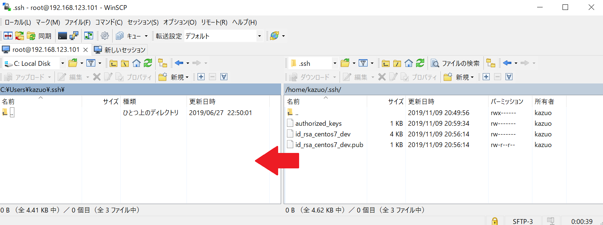

<!-- TOC -->

- [はじめに](#はじめに)
- [VirtualBoxについて](#virtualboxについて)
    - [VirtualBoxって何？](#virtualboxって何)
    - [利用環境](#利用環境)
- [Linuxについて](#linuxについて)
    - [Linuxって何](#linuxって何)
    - [ディストリビューションについて](#ディストリビューションについて)
- [LPICについて](#lpicについて)
    - [LPICって何](#lpicって何)
    - [LPICを何がいいの](#lpicを何がいいの)
- [開発環境の構築](#開発環境の構築)
    - [やる事のイメージ](#やる事のイメージ)
    - [用意するもの](#用意するもの)
    - [インストール](#インストール)
    - [初期設定](#初期設定)
    - [グループ・ユーザー作成](#グループ・ユーザー作成)
        - [グループ作成](#グループ作成)
        - [ユーザー作成](#ユーザー作成)
        - [認証キー作成](#認証キー作成)
    - [SSH接続](#ssh接続)
        - [SSH接続について](#ssh接続について)
        - [SSHの設定ファイル編集](#sshの設定ファイル編集)
        - [マシン接続](#マシン接続)
        - [認証キーの整理](#認証キーの整理)
- [終わりに](#終わりに)
- [【オマケ】GitLabについて](#オマケgitlabについて)
    - [GitLabって何](#gitlabって何)
    - [GitとGitホスティングサービスは必須](#gitとgitホスティングサービスは必須)
    - [インストール](#インストール)

<!-- /TOC -->

# はじめに
この度は『自分のタイミングでLinuxの勉強をしたい』という方のために資料を作成しました。<br /><br />

目覚ましい技術の発展で個人でもクラウドを自由に利用できる環境が整っています。<br /><br />
そして、Linuxを利用する企業も昔に比べると格段に増え需要は高まっており、求められるスキルは高まるばかりです。<br />
しかし、新人や未経験者にはハードルが高くお金も発生するため、クラウドへは手を出すのが難しい...だけど時間は待ってくれない...というジレンマが付き纏います。<br /><br />

今回はクラウドから離れて『自分の好きなタイミング』、『自分の好きな開発』ができる環境を『自分で』作れるようになる講習となります。<br />
※この講習は入門レベルのため、難しい説明は省きます。<br /><br />

# VirtualBoxについて
## VirtualBoxって何？
Oracle社が提供する仮想化ソフトです。
VirtualBoxを利用することでWindowsマシン上（ホストOS）で異なるOS（ゲストOS）を起動することができます。

<キーワード>
仮想化ソフト、ホストOS、ゲストOS

<参考>
https://www.virtualbox.org/

## 利用環境
Windows、Linux、Macintosh、Solarisといった主要なOSでほぼ利用できます。
※ここではWindows環境の利用を紹介となります。

# Linuxについて
## Linuxって何
リーナス・トーバルズとういう人物が大学生の時に自分用に作成したOSです。<br />
1970、1980年頃は大学や研究所でUnixというOSがよく利用されていましたが、ライセンスの問題などもあり、ゼロベースから作ったOSです。

## ディストリビューションについて
様々なディストリビューションが配布されています。
今回は主にサーバー向けのOSを紹介します。

# LPICについて
## LPICって何
LPIC（Linux Professional Institute Certification）はLinux技術者の技術者認定資格になります。
レベル1～3まで分けられており、レベル3になるにつれて難易度があがっていきます。（公式は[コチラ](https://www.lpi.org/ja/)）

## LPICを何がいいの
アプリケーション開発の中枢ではプログラムだけ組んでいればいいという事はありません。<br />
マシンのスペック、OSの性能を最大限に引き出してパフォーマンスを出す作業をやっております。
そういった開発（Linux環境）に携わる場合、Linuxの特徴（仕様）を理解していないと出来ません。
LPICを勉強するとそういった点が理解できて業務時間の短縮、品質向上が可能になります。<br />
個人的にはレベル2（システム管理、サーバー構築）まで持っていると業務に役に立つと思います。

# 開発環境の構築
## やる事のイメージ
今回は手順に沿ってVirtualBox上にマシンを構築してTera Termで接続できるところまで考えています。

## 用意するもの
WindowsのPC / VirtualBox / CentOS7のイメージ / Tera Term / WinScp

## インストール
別紙参照

## 初期設定
## グループ・ユーザー作成
root以外のユーザーを作成して作業します。<br /><br />

### グループ作成
先ずはユーザーが所属するグループを作成します。
作成は下記の作業を行います。
 * 作成グループが存在するのか確認する
 * グループの作成する
 * グループが作成されたことを確認する
 
```
$ less /etc/group
$ groupadd 作成するグループ名
$ cat /etc/group | grep 作成したグループ名
```
<br />

### ユーザー作成
マシンにroot以外のユーザーを作成します。
作成は下記の作業を行います。
 * ユーザーを先ほどのグループに所属させて作成する
 * ユーザーが作成されたことを確認する

```
$ useradd -g 作成したグループ名 作成するユーザー名
$ cat /etc/password | grep 作成したユーザー名
```

後ほどパスワード認証の接続を確認を行います。<br />
そのため、このタイミングで作成したユーザーのパスワードを設定します。
```
# passwd ユーザー名
ユーザー XXXXX のパスワードを変更。
新しいパスワード: パスワードを入力
新しいパスワードを再入力してください: パスワードを入力
passwd: すべての認証トークンが正しく更新できました。
```

### 認証キー作成
作成したユーザーでマシンへSSH接続するために認証キーを作成します。
ここでは下記の作業を行います。
 * 認証キーの置き場所作成する
 * パスワード無しで接続できる認証キーを作成する
 * 鍵の種別はrsaにする
 * ビット数は4096にする

<br />
先ずはrootから作成したユーザーに切り替えます。

```
# su - kazuo
```
<br />
次に認証キーを格納する場所を用意します。

```
$ mkdir -m 0700 .ssh
$ cd ~/.ssh
$ ssh-keygen -b 4096 -N "" -t rsa -C "開発用認証キー" -f id_rsa_centos7_dev
$ cat id_rsa_centos7_dev.pub > authorized_keys && chmod 0600 authorized_keys
```

<br />
秘密鍵と公開鍵が作成できたらファイル転送ツールでダウンロードします。<br />
※WinScpを利用する場合、初期設定で隠しファイルが非表示になっているのでオプション > 環境設定 > パネル > 一般の”隠しファイルを表示する”にチェックを入れます。


<br />

## SSH接続
### SSH接続について
一般的にrootでの接続や操作は管理者でもない限り殆ど行いません。
また、ここでは下記を行います。
 * SSH接続するための設定ファイル編集する
   * rootでのログインを禁止する
   * パスワードによる認証を禁止する
   * パスワード無しを許可する
 * 作成したユーザーの認証キーでTera Termでマシンへ接続する

### SSHの設定ファイル編集
rootに戻って設定ファイルを編集します。
先に編集する設定ファイルと項目を上げておきます。
また、編集が終わったらsshdプロセスを再起動して設定ファイルの内容を反映させます。

<設定ファイル><br />
/etc/ssh/sshd_config

<編集項目>

| 項目名 | デフォルト | 変更値 | 詳細 
|:--|:--:|:--:|:--|
| PermitRootLogin | yes | no | rootでログインを不可 |
| PasswordAuthentication | yes | no | パスワード認証を不可 |
| PermitEmptyPasswords | no | yes | 認証キーの空パスワードを許可 |
| GSSAPIAuthentication | yes | no | 外部認証を不可 |
| UseDNS | yes | no | DNS参照を不可 |

```
$ exit
# vi /etc/ssh/sshd_config
# ### 上記の<設定項目>を参照して編集 ##
# systemctl restart sshd
```

### マシン接続
Tera Termを準備します。<br />
先ほど設定した内容の通り挙動になるか確認をしながらSSH接続します。
1. rootで接続できないこと
1. 作成したユーザーのパスワード認証で接続できないこと
1. 作成したユーザーと秘密鍵（空パスワード）で接続できること

注：rootで接続は禁止にしましたが、仮想マシンから直接なら接続は可能です。

### 認証キーの整理
SSH接続の確認ができたらマシンにある不要な認証情報を削除します。<br />
~/.ssh以下をauthorized_keysのみ残します。

```
$ cd ~/.ssh
$ rm id_rsa_centos7_dev*
$ ls -l 
```

# 終わりに
これで自由に作業ができる環境が整いました。<br />
後は皆様の好きなように利用して楽しいLinuxライフを過ごしてくださいませ！

# 【オマケ】GitLabについて
## GitLabって何
簡単に言ってしまうとGitHubのOSS版のようなものです。
最近はクラウド化が進み手軽に大規模なシステム設計が可能になったこともあり、自前でGitのホスティングサービスを構築する企業も増えております。
背景には社内セキュリティポリシーのためGitHubが利用できないといった企業が、GitLabを利用する場面が多いようです。

## GitとGitホスティングサービスは必須
今日のエンジニアはGitを利用できて当たり前です。
また、それと同時にGitのリポジトリサービスも使いこなすスキルが求められます。
GitHubを無料枠で利用するのも結構ですが、せっかく自分で環境を構築できるようになったのですから、GitとGitLabをインストールして操作をしたらより深く理解できると思いませんか？
GitLabはGitHubと同じような機能が沢山ありますし、企業で採用さあれる場面も増えてくるでしょう。
是非、この機会にGit、GitLabをインストールしてマスターしてみてくださいませ。

## インストール
[ここ](https://about.gitlab.com/install/#centos-7)に詳しくインストールする手順が書いてあります。
